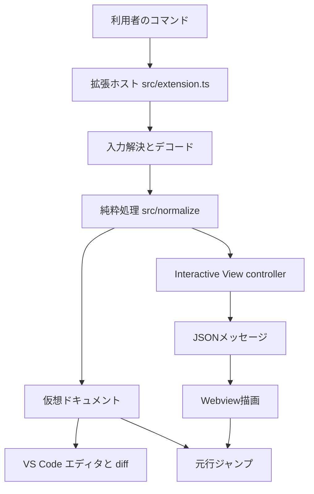
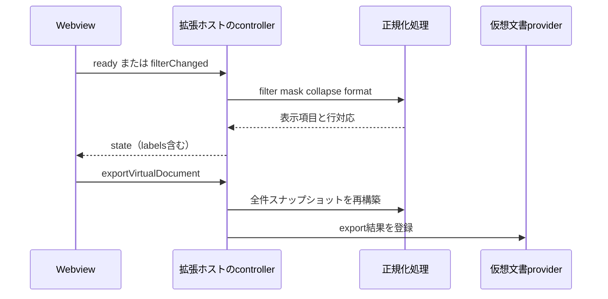

# アーキテクチャ概要

## 設計の中心

Totonoe Logは、多様な入力形式を `LogEntry` へ変換する純粋ロジックと、それをVS Codeに表示する統合層を分離する。`src/normalize/` をVS Code APIから独立させることで、ログ処理を大量の単体テストで検証し、仮想ドキュメントとInteractive Viewの両方から再利用している。共通モデルの詳細は[ログ処理ドメイン](/openwiki/domain/log-processing.md)を参照する。

この図は、1つの正規化層から2つの表示経路へ分岐し、行対応を保ったまま元ログへ戻る構造を示す。

## レイヤーと責務

| レイヤー | 主な場所 | 責務 |
| --- | --- | --- |
| 拡張エントリ | `src/extension.ts` | provider、controller、コマンド、HoverProviderを登録する |
| 入力・設定 | `src/logFileReading.ts`, `logSourceDocument.ts`, `*Settings.ts` | エディタまたはディスクから読み、encoding・timezone・clock skew等を解決する |
| ドメイン処理 | `src/normalize/` | parse、merge、filter、mask、collapse、format、line mappingを行う |
| 仮想文書 | `src/virtualDocumentContentProvider.ts`, `normalizedView.ts`, `mergedView.ts`, `compareView.ts` | 読み取り専用本文、再フィルタ材料、元行対応をURI単位で保持する |
| Interactive controller | `src/interactiveView.ts`, `src/interactiveViewLabels.ts` | Webviewの状態、翻訳済み動的ラベル、ファイル群、非同期処理、export、timestamp pattern提案、設定変更を調停する |
| Timestamp helper | `src/normalize/timestampPatternInference.ts`, `timestampPatternPreview.ts`, `src/timestampFormatSettings.ts` | 選択範囲からの純粋なpattern推論、保存時と同一規則のpreview、VS Code設定へのscope-awareな書き戻しを分担する |
| Interactive HTML template | `src/interactiveViewHtml.ts` | 拡張ホスト側で翻訳済みHTML/CSS、CSP、Webview script tag、文書の `lang` を組み立てる |
| Webview UI | `src/webview/interactiveView/main.ts` | hostから受け取ったラベルでフォーム操作と安全なテキスト描画を行う |
| 共有protocol | `src/webview/interactiveView/protocol.ts` | Node・DOM・`vscode`に依存しないJSON可能な状態型と翻訳済みラベル型を定義する |

実装位置を目的別に引くには[ソースマップ](/openwiki/source-map.md)を使う。

## 仮想ドキュメント経路

`VirtualDocumentContentProvider` はURIごとに本文、`SourceLineMap`、必要なら `FilterableViewSource` をメモリ保持する。`update()` は `onDidChange` を発火し、同じタブを開いたまま再絞り込み結果へ更新する。正規化・マージの読み取り専用ビューでVS Code標準の検索、コピー、エディタ、元行ジャンプを使えることが目的である。

重要な制約は次のとおり。

- 整形済みテキストはガターや列が行頭に付くため、`parseLog` へ再投入しない。`guardAgainstVirtualDocumentSource` が拒否する。
- `onDidCloseTextDocument` により保持データを解放する。VS Code内部の文書解放後に再要求された場合は、空文字ではなく再実行を促す文言を返す。
- Interactive Viewのexportはマスク・折りたたみを含むスナップショットなので、後付け `Set Filter` 用の元エントリを登録しない。
- 50 MiB以上のマージ結果はglobal storage上の一時ファイルとして通常タブで開くため、元行ジャンプと `Set Filter` は使えない。

この経路を含む利用フローは[ログ調査ワークフロー](/openwiki/workflows/log-investigation.md)、VS Code APIとの接続は[VS Code統合](/openwiki/integrations/vscode.md)にある。

## Interactive View経路

`InteractiveViewPanelController` は同時に1パネルを管理する。パネル生成時はscript URI、nonce、`vscode.env.language` を `buildInteractiveViewHtml` へ渡し、`src/interactiveViewHtml.ts` が拡張ホスト側の翻訳済みHTML/CSS、CSP、文書の `lang` を構築する。このtemplateはbrowser bundleではないため `src/webview/` ではなく `src/` 直下に置かれ、`src/test/suite/interactiveViewHtml.test.ts` がCSPと `main.ts` の `getElementById` に対応する要素IDを検証する。

Webviewは条件をJSONで送り、拡張ホストがworker threadを含む正規化処理を実行して、表示データと `src/interactiveViewLabels.ts` で翻訳した動的UI文言を `state` メッセージで返す。保存前のtimestamp pattern提案だけは設定や表示stateを変更しないため、`timestampPatternRequested` に対して専用の `timestampPatternResult` を返す。静的UI文言は `src/interactiveViewHtml.ts` が生成時に翻訳する。`RegExp` や `Set` は送信しない。提案から `totonoeLog.timestampFormats` の保存・再parseまでの詳細は[タイムスタンプ形式補助ワークフロー](/openwiki/workflows/timestamp-format-helper.md)を参照する。

この図は、Webviewを描画専用に保ち、処理とexportを拡張ホストへ集約する流れを示す。

ユーザー入力の正規表現は重くなり得る。match、ignore、mask、highlightはworkerとジョブ単位のタイムアウトで拡張ホストを守る。`src/normalize/patternWorkerSession.ts` の `PatternWorkerSession` は、1回の再描画内ではこれらの処理に同じworkerを使い、起動コストを抑える。セッションは再描画をまたいで共有せず、重なった再描画を別workerで並行できるようにする。timeoutまたはworkerエラー時はそのworkerを破棄し、次のジョブで再生成する。さらに `RefreshRevisionGate` がlatest-winsを保証し、古い重い条件の完了結果が新しい表示を巻き戻さないようにする。詳細な操作順は[ログ調査ワークフロー](/openwiki/workflows/log-investigation.md)、回帰確認は[テスト戦略](/openwiki/testing/guide.md)を参照する。

## ビルド境界

`scripts/esbuild.js` は2つを別々にbundleする。

- `src/extension.ts` → `out/extension.js`: CommonJS、Node 18 target、`vscode`はexternal。
- `src/webview/interactiveView/main.ts` → `out/webview/interactiveView/main.js`: IIFE、browser、ES2020 target。

Webview bundleでは `vscode` をexternalにしない。Webviewから誤って拡張ホスト依存をimportした際にビルドを失敗させ、境界違反を検出するためである。運用コマンドは[開発運用ランブック](/openwiki/operations/runbook.md)にまとめる。

## 表示方式の使い分け

仮想ドキュメントはVS Code標準の検索・コピー・diffを活かす読み取り専用の出力に使う。継続的な絞り込み・マスク・折りたたみ・ハイライトをその場で操作する場合はInteractive ViewのWebviewを使い、必要に応じて結果を仮想ドキュメントへexportする。どちらの表示方式も `src/normalize/` の処理を共有し、Webview側へログ処理を重複実装しない。
