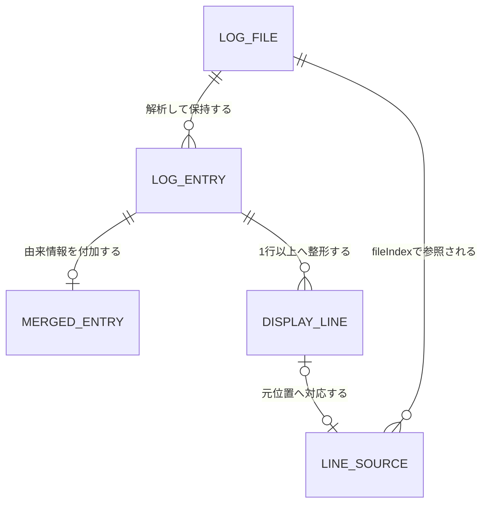
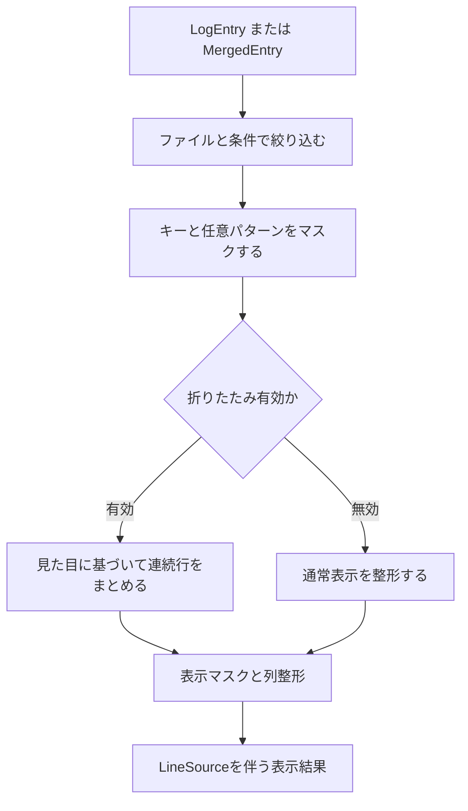

# ログ処理ドメインと不変条件

## 共通モデルが存在する理由

ログ形式ごとの差を下流へ漏らさないため、全機能は `src/normalize/types.ts` の `LogEntry` を共有する。[アーキテクチャ概要](/openwiki/architecture/overview.md)の純粋処理層は、このモデルを中心にマージ、絞り込み、折りたたみ、比較を組み立てる。

## 主要概念

### `LogEntry`

1件の論理ログエントリであり、複数の物理行を含められる。

| フィールド | 意味 |
| --- | --- |
| `timestampMs` | 認識できた絶対時刻。未認識なら `undefined` |
| `rawTimestamp`, `timestampFormat` | 元の時刻文字列と認識した形式名 |
| `severity` | 大文字へ正規化したレベル。`WARNING` は `WARN` |
| `message` | 時刻・severityを除いた先頭行と継続行 |
| `startLine` | 元ログの1始まり先頭行番号 |
| `lines`, `raw` | 情報を失わない元物理行と結合テキスト |
| `matched` | 先頭行のタイムスタンプを認識できたか |

`parseLog` は認識済み時刻で始まる行を新しいエントリとし、それ以外を直前の継続行にする。最初の認識行より前の行や、全く認識できないログも `matched: false` で保持し、サイレントに捨てない。

### `MergedEntry`

`LogEntry` に `fileName`、ローテーション記号を除いた `kind`、入力配列上の `fileIndex` を付ける。異なるフォルダに同名ファイルが存在できるため、由来の識別には名前ではなく `fileIndex` を使う。

### `LineSource`

表示行を `{ fileIndex, line }` へ結び付ける。ギャップマーカー等の生成行は `undefined` である。formatterは本文と行対応を同時に作り、フィルタや折りたたみ後も可能な範囲で元行ジャンプを維持する。この関係は[ログ調査ワークフロー](/openwiki/workflows/log-investigation.md)と[VS Code統合](/openwiki/integrations/vscode.md)の双方で使われる。

この図は、元ファイルから論理エントリ、表示行、元位置対応へ変換される関係を示す。

## 時刻の解釈とマージ

処理順は重要である。

1. custom timestamp formatsを組み込み形式より先に試す。
2. 時刻自体にoffsetや `Z` がなければ、ファイル別または共通のsource offsetを仮定する。
3. parse後、認識済み時刻すべてへclock skewを加える。
4. 補正後の `timestampMs` でマージする。

マージは時刻昇順、未認識を末尾に置く。同一時刻または双方未認識では、ファイル入力順とファイル内出現順を明示的なtie-breakにする。推測によるtimezone自動検出は行わない。確証のない推測で時系列を静かに壊す方が危険だからである。

## フィルタの論理

`FilterCriteria` の指定フィールド間はAND、`matchPatterns` 内と `ignorePatterns` 内はそれぞれORである。適用順はseverity、date range、match、ignore。軽い条件を先に適用し、通常は強く絞るmatchをignoreより先にして、workerで評価する件数を減らす。

matchとignoreは `raw` ではなく複数行の `message` を対象にする。時刻とseverityには専用条件があり、メッセージ中のスタックトレースをエントリ単位で残すためである。正規表現の評価失敗時は、誤った全件表示へ黙ってfallbackせず、呼び出し側が警告と現在表示の維持を選べる結果を返す。

## マスクと折りたたみ

Interactive Viewの概念的な順序は次のとおり。

この図は、フィルタ結果をマスクしてから折りたたみ判定へ渡し、最後まで行対応を運ぶ順序を示す。

- タイムスタンプは `message` に含まれないため、繰り返し比較の対象外。
- IPアドレスは比較時に常に除外される。
- マスクON時はホスト、PID、キー値、任意パターンを伏せた結果が同じなら折りたためる。
- マージ時は由来ファイルを区別せず連続する同一メッセージをまとめる。複数サーバのheartbeatが交互に並ぶ実態に合わせるためである。
- 折りたたみ表示ではグループ内部のどこへgapを置くか定義できないため、gap markerを挿入しない。

severity列は表示集合に合わせて幅を揃える。タイムスタンプを認識した複数行エントリでは、継続行も見出しのメッセージ開始桁まで下げ、元からあるスタックトレース等のインデントをその上に保つ。字下げ幅は表示タイムゾーンや `<TIMESTAMP>` マスクで変わるため、`src/normalize/severityColumn.ts:messageColumnIndent` が実際のタイムスタンプ文字列とseverity列幅から計算する。タイムスタンプ未認識のエントリはメッセージ列を持たないので字下げせず、本文の行数と `LineSource` も変えない。

比較ビューでは、左右で列幅が異なると同じ本文までdiffになるため、severityのpaddingも継続行の字下げも適用しない。この例外は `src/normalize/severityColumn.ts` と `src/normalize/maskForCompare.ts` の変更時に守る。表示整形の回帰確認は[テスト指針](/openwiki/testing/guide.md)に従う。

## 変更時の不変条件

- 未認識行を捨てない。
- 複数行エントリの物理行順、元のインデント、`startLine` を維持する。継続行を表示上字下げしても行数と元行対応は変えない。
- 本文の行数を変える変換では `LineSource` も同時に更新する。
- timezone情報がログに明示されている場合は設定よりログを優先する。
- 同一時刻のマージ順を非決定的にしない。
- マスクはフィルタ対象を意図せず変えず、折りたたみ判定だけを変え得る。
- ユーザー正規表現を拡張ホストの主処理で無制限に評価しない。

これらを変更する場合は[テスト戦略](/openwiki/testing/guide.md)の `normalize.test.ts` を中心に、利用経路に応じて統合テストを追加する。
