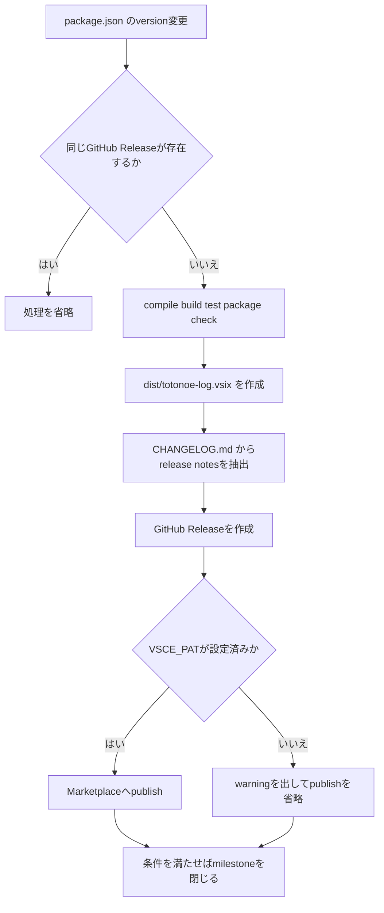

# ビルド・パッケージ・リリース運用

## ローカル検証

```bash
npm ci
npm run compile
npm run lint
npm run build
npm test
npm run check:package
```

`npm test` はcompile済みtestsとbundle済み `out/extension.js` を使うため、`compile` と `build` を先に行う。開発中は `npm run check-types`、`npm run lint`、`npm run watch` を使う。選択基準は[テスト指針](/openwiki/testing/guide.md)に従う。

## VSIX

```bash
npm run package
code --install-extension dist/totonoe-log.vsix --force
```

`npm run package:install` でも連続実行できる。`scripts/check-package-contents.js:EXPECTED` はVSIX同梱物を固定するallowlistであり、意図しないソースや機密ファイルの混入を防ぐ。同梱物を変える場合は `.vscodeignore` と `EXPECTED` を同時更新する。

## CI

`.github/workflows/ci.yml` はpull requestと `main` pushで動く。

- lint: Ubuntu / Node 24.x。
- test: WindowsとUbuntuのmatrixでcompile、build、test、package check。
- Linux test: `xvfb-run -a npm test`。
- stable VS Codeを解決し `.vscode-test` をcacheする。

この構成は[アーキテクチャ概要](/openwiki/architecture/overview.md)の拡張ホスト・Webview両bundleとVS Code実環境を検証する。

## リリース

`.github/workflows/release.yml` は `main` 上の `package.json` 変更で起動する。



図: version変更を契機に検証、VSIX、GitHub Release、任意のMarketplace公開を行う。

`VSCE_PAT` はGitHub Secretとしてのみ扱い、値を文書・ログへ出さない。release notesは `scripts/extract-changelog-section.js` が作る。

## 変更同期チェックリスト

- ユーザー影響: `CHANGELOG.md` と `CHANGELOG.ja.md`。
- 利用者説明: `README.md` と `README.ja.md`。
- command/menu: `package.json`, `src/extension.ts`, 英日 `docs/features/commands.*.md`。
- ログpattern依存機能: `demo/` に代表行を追加。
- package同梱物: `.vscodeignore` と `EXPECTED`。
- TypeScript: 先に `docs/coding-guidelines.md` を読む。

変更箇所は[ソースマップ](/openwiki/source-map.md)、公開面は[VS Code統合](/openwiki/integrations/vscode.md)で確認する。

## OpenWikiの更新

OpenWikiはCIで自動更新せず、リリース前にまとめて更新する。加えて、ファイル構成、command、ビルド・テスト手順、アーキテクチャ方針を変えたPRのマージ後にも更新する。毎PRで再生成しないのは、無関係な生成差分が機能レビューを妨げるのを避けるためである。

```bash
openwiki code --update --language ja-JP
```

生成差分は機能変更と混ぜず、`docs: OpenWiki を更新` のような単独PRにする。`openwiki/**` は `.vscodeignore` によりVSIXから除外されるため、リリース直前の更新はパッケージ内容へ影響しない。詳細な正本は `AGENTS.md` の「OpenWiki」節であり、Wikiの入口は[クイックスタート](/openwiki/quickstart.md)である。

## 切り分け

- **仮想文書の内容消失**: `CONTENT_LOST_PLACEHOLDER` なら元commandを再実行する。providerの内容は永続化されない。
- **大容量マージで機能が減る**: 50 MiB以上は通常ファイルfallbackのため `Set Filter` と元行ジャンプがない。Interactive Viewで絞る。
- **古い条件が表示される**: `RefreshRevisionGate` と各 `await` 後の `isCurrent()` を確認する。
- **設定変更が反映されない**: `interactiveViewConfigWatch.ts` のreparse・redisplay分類とresource scopeを確認する。
- **Marketplaceだけ公開されない**: `VSCE_PAT` 未設定時はGitHub Releaseだけ作成する仕様である。

利用者の現象から処理経路を追う場合は[ログ調査ワークフロー](/openwiki/workflows/log-investigation.md)を参照する。
