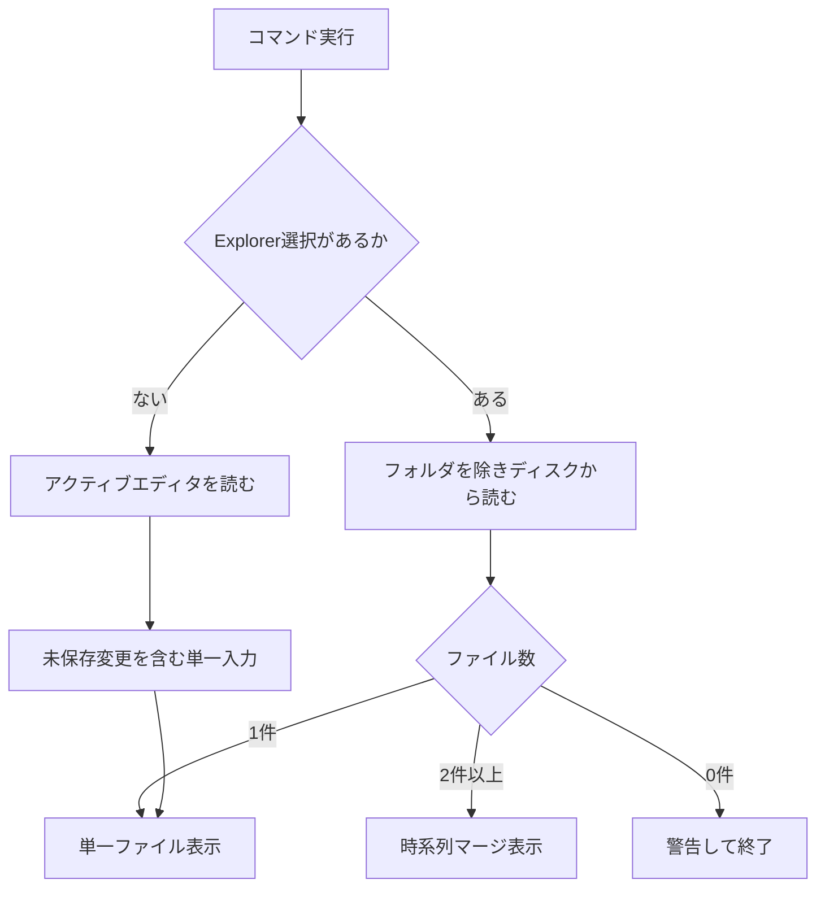
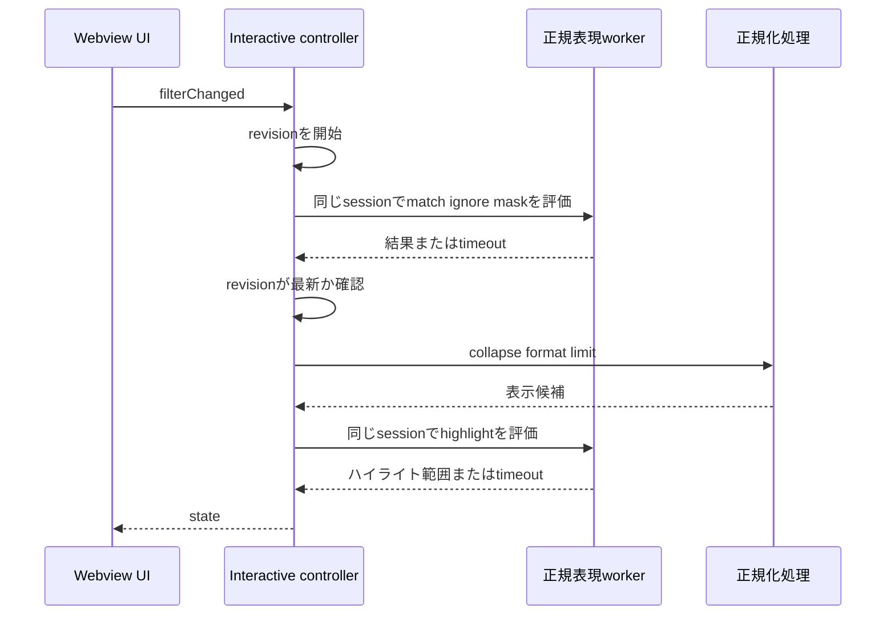

# ログ調査ワークフロー

## 入力の決定

`Show Interactive View` と `Open in Virtual Document` は同じ入力規則を共有する。

この図は、Explorer経由ではディスク内容、パレット経由では未保存変更を含むエディタ内容を使う違いを示す。

Explorer経由では各URIの `files.encoding` を使ってdecodeし、未対応値なら警告してUTF-8へfallbackする。フォルダだけを選んだ場合は関係ないアクティブエディタへfallbackしない。Totonoe Log自身の整形済み仮想文書は再parseできないため入力として拒否する。

## 正規化と仮想文書

`totonoeLog.openVirtualDocument` は1件なら `openNormalizedViewForFile` / `openNormalizedViewForDocument`、2件以上なら `openMergedView` へdispatchする。共通モデルと時刻補正は[ログ処理ドメイン](/openwiki/domain/log-processing.md)を参照する。

仮想文書はVS Code標準の検索、コピー、選択、エディタ表示を使える。`totonoeLog.setViewFilter` はproviderが保持する絞り込み前のエントリへ毎回条件を掛け直し、同じURIの本文と行対応を更新する。前回結果への重ね掛けではないため、条件を緩めれば行は戻る。

50 MiB以上のマージ結果は一時ファイルとして通常タブで開く。この経路では `Set Filter` と `Go to Source Line` が使えない。大きな結果に動的操作が必要ならInteractive Viewで絞り、exportを使う。

## Interactive Viewの再描画

この図は、重い正規表現評価を隔離し、1回の再描画内ではmatch・ignore・mask・highlightに同じ `PatternWorkerSession` を使いながら、古い要求の結果を捨てるlatest-wins再描画を示す。セッションは再描画ごとに破棄されるため、重なった再描画は互いのworker待ちにならない。

1ファイルでは元の行順を維持し、2ファイル以上で時刻順へmergeする。ファイル表示、severity、date、match、ignoreを適用した後、custom mask、collapse、format、表示上限、highlightの順に状態を作る。設定変更のうち `timestampFormats`、source/file timezone offset、clock skewは再parseを必要とし、その他は保持済みエントリから再描画する。Interactive Viewの「タイムスタンプ ▾」は `timestampFormats` 自体を編集し、設定変更監視を通じて再parseする。未認識行の選択から保存までの専用フローは[タイムスタンプ形式補助ワークフロー](/openwiki/workflows/timestamp-format-helper.md)を参照する。

match・ignoreの各欄は欄内OR、欄同士ANDである。不正な個別パターンは名指しして外し、残りを動かす。日付範囲の終了値は入力した最小単位の末尾までを含み、たとえば分までの入力はその分の `59.999` 秒まで残す。表示上限 `totonoeLog.interactiveView.maxDisplayLines` はWebview送信時だけに効き、折りたたみでは見出し行と展開後の全行を合わせたDOM行数を数える。exportは切り詰めず全結果を対象にする。

## マスク、折りたたみ、ハイライト

- マスクは標準対象のtimestamp、host/IP、PIDに加え、キー値と任意正規表現を扱う。
- キー・任意パターンは設定へ保存しない。隠したい語自体を設定に残さないためである。
- マスク後に同じに見える連続行はcollapseできる。マージでは由来ファイルをまたいでまとめる。
- highlightは行を消すfilterとは別で、周辺文脈を残したまま一致箇所へ色を付ける。範囲が重なる場合は `totonoeLog.highlightRules` で先に書かれたルールを優先し、後続ルールの非重複一致は残す。設定の唯一の置き場は同じ `totonoeLog.highlightRules` で、パネル編集もそこへ書き戻す。
- マルチルートでは既存定義のあるfolder scopeへ書き戻すことを `src/highlightRuleSettings.ts` が保証する。

## Export as Virtual Document

exportは押下時点のcriteriaをメッセージに同送する。入力欄の `filterChanged` は300ms debounceされるため、controllerが最後に受けた状態だけを使うと、直前に入力したマスクが漏れる危険があるからである。

exportにはファイル表示、filter、merge、collapse、mask、行対応が反映される。Webview内で個別に展開したcollapse groupはブラウザローカル状態であり、exportではcollapse見出しとして出る。結果はパネル状態のスナップショットなので、export後の仮想文書には `Set Filter` を適用できない。

## 比較

`totonoeLog.compareLogs` はファイル選択ダイアログを2回開き、両ログの可変部分をmaskした `totonoe-log-compare` 文書をVS Code標準diffへ渡す。比較ビューに元行対応はない。

注意: `README.ja.md` とコマンド文書にはInteractive Viewのexport後タブへ `Compare Logs` を実行できる旨があるが、現在の `src/compareView.ts` はアクティブタブではなくファイル選択ダイアログを使う。実装変更または文書修正までは、exportを直接比較できると仮定しない。

## 元行ジャンプ

仮想文書はproviderの `SourceLineMap`、Interactive Viewは各表示項目の `LineSource` を使い、最終的に `revealSourceLine` へ渡す。マージ表示では複数ファイル間で意味の揃わない元行番号ガターを表示しないが、この対応表は維持される。単一ファイル表示の行番号ガターは残る。ギャップ等の生成行には対応先がない。collapse見出しはWebviewでは展開操作を優先し、export文書ではグループ先頭へ対応付けられる。

この一連のVS Code接続は[VS Code統合](/openwiki/integrations/vscode.md)、変更箇所は[ソースマップ](/openwiki/source-map.md)、回帰テストは[テスト戦略](/openwiki/testing/guide.md)を参照する。
