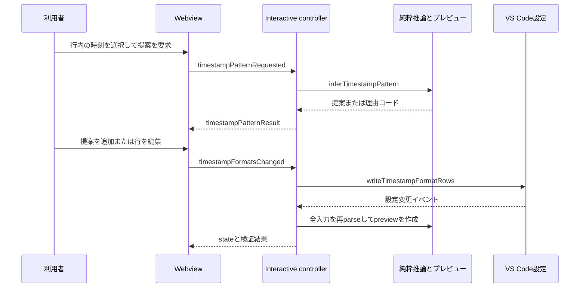

# タイムスタンプ形式補助ワークフロー

## いつ参照するか

次の変更ではこのページを起点にする。

- Interactive View の **Timestamp ▾** パネル、未認識行一覧、提案・検証表示を変更する。
- `totonoeLog.timestampFormats` の読み書き、保存scope、設定変更後の再parseを変更する。
- 日付・エポック・timezone offsetの選択範囲から正規表現を推論する規則を増やす。
- 低いタイムスタンプ認識率の警告から補助パネルを開く導線を変更する。

利用者向けの完全な設定構文は `docs/features/custom-timestamp-formats.ja.md` が正本であり、このページは実装境界と変更安全性を扱う。解析後の `LogEntry` と時刻解釈は[ログ処理ドメイン](../domain/log-processing.md)、通常の入力・表示・exportは[ログ調査ワークフロー](log-investigation.md)を参照する。

## 実行フロー



この図は、提案段階では設定を変えず、明示的な追加・編集後だけ設定へ書き戻し、既存の設定監視経路で再parseする流れを示す。

`InteractiveViewPanelController.buildTimestampFormatPanelState()` は、`collectUnrecognizedLines()` で空行を除いた先頭の未認識行を最大10行収集し、保存済みの各行を `previewTimestampFormat()` へ通す。Webviewへ送る `state` には `timestampFormatRows`、`timestampFormatsScope`、`unrecognizedSampleLines`、認識率警告の有無、一度だけパネルを展開するフラグが含まれる。[VS Code統合](../integrations/vscode.md)のprotocol境界上、ログ本文や未認識行は非信頼データなので、browser側は `textContent` と `data-raw-line` を使い、HTMLとして解釈しない。

## 推論規則と限界

`src/normalize/timestampPatternInference.ts` の `inferTimestampPattern()` は選択範囲を数字、英字、区切り文字のrunへ分け、次の形だけを提案する。

- カレンダー形式: 4桁年、月、日、時、分、秒。任意で小数秒と末尾の `Z` / `z`、`+09:00`、`+0900`、`+09`。
- エポック形式: 13桁の `epochMs`、10桁の `epochSec`、または `epochSec` と小数部。
- 行頭以外の選択: 選択開始位置を上限128文字に丸めた `.{0,N}?` を前置し、custom formatの行頭アンカーと両立させる。

日と月がどちらも12以下なら、年が先頭のときは既定で月・日、年が末尾のときは日・月とし、UIから `dmy` / `mdy` を明示して再推論できる。提案名は `DD.MM.YYYY_hh:mm:ss` のようにフィールド順と区切りを反映し、エポックは `custom-epoch-ms` / `custom-epoch-sec` を使う。

提案しない入力は、空選択、月名、複数文字の未対応英字token、2桁年、完全な日時またはエポックとして必要なfieldが足りない選択である。純粋層は `TimestampPatternInferenceFailureReason` のcodeだけを返し、`src/timestampPatternMessages.ts` が `vscode.l10n.t()` で表示文へ変換する。この分離は[ログ処理ドメイン](../domain/log-processing.md)の「normalize層を表示言語から独立させる」境界に従う。

## プレビュー、保存scope、ライフサイクル

`previewTimestampFormat()` は `compileCustomTimestampFormats()` をそのまま使うため、プレビューだけ通って保存後のparseでは無効になる別実装を持たない。正規表現に一致しても2月30日など日時へ変換できない場合は、`matchedText` を保持しつつ `matched: false` とする。パネル上では検証エラー、または未認識サンプルの認識件数として表示される。

`src/timestampFormatSettings.ts` の書き戻しには次の不変条件がある。

1. 不正な既存patternも編集可能な行として残す。空patternの編集中行は設定へ書かない。
2. 行順はcustom formatの試行順なので維持する。空のnameは省略し、既定名に任せる。
3. `readConfiguredTimestampFormats()` がresource無しで読むため、folder scopeへは保存しない。既存のworkspace値があればworkspace、なければuserへ保存し、workspaceが無ければ常にuserを使う。
4. `writeTimestampFormatRows()` 自身は再描画しない。`totonoeLog.timestampFormats` のconfiguration changeを `interactiveViewConfigWatch.ts` が受け、全ファイルを再parseする。
5. 保存直後の別ファイルでも同じ設定を読める。APIの内部単体テストだけでなく、`src/test/suite/extension.test.ts` の仮想文書経路で実利用面を確認する。

このscopeは `highlightRules` と異なる。後者はresource-awareなfolder書き戻しを持つが、`timestampFormats` に同じ挙動を足すには読み取り側からresource対応しなければならない。

## 認識率警告からの導線

仮想文書側の低認識率警告は `src/timestampRecognitionWarning.ts` がファイル単位・拡張セッション中1回に制御する。`src/extension.ts:activate()` が `registerTimestampFormatHelperOpener()` を一度配線し、アクション選択時に対象URIを `loadLogFiles()` で読み、`showOrRevealFocusingTimestampPanel()` を呼ぶ。controllerは次の `state` だけ `focusTimestampPanel: true` にして直ちにflagを戻すため、利用者が閉じたパネルを通常の再描画ごとに開き直さない。

Interactive View内の警告ボタンはhostへ要求せず、既に開いているWebviewのパネルをローカルに展開する。この導線を変える場合は[ログ調査ワークフロー](log-investigation.md)の入力規則を崩さず、警告対象ファイルを別のアクティブ文書へ置き換えないことを確認する。

## 変更レシピ

### 推論できる形式を追加する

1. `inferTimestampPattern()` のtoken分類、timezone抽出、`DigitRole`、failure reasonを必要最小限変更する。
2. 新しいgroupが `compileCustomTimestampFormats()` で実際に解釈可能か確認する。推論だけにgroupを足してはならない。
3. `src/normalize/index.ts` の公開exportが変わる場合はtypeと関数を同期する。実消費者は `src/interactiveView.ts` であり、consumer import経路までcompileする。
4. `timestampPatternInference.test.ts` に「提案 -> compile -> parse」の往復、曖昧性、拒否条件、行頭以外を追加する。
5. failure reasonを増やしたら `src/timestampPatternMessages.ts` と `l10n/bundle.l10n.ja.json` を同期し、localizationテストも実行する。

### パネル状態またはメッセージを追加する

1. `src/webview/interactiveView/protocol.ts` を正本としてhost送受信型を変更する。
2. `src/interactiveView.ts` のmessage dispatchと `postState()`、`src/webview/interactiveView/main.ts` のhandler・描画を同期する。
3. 静的要素は `src/interactiveViewHtml.ts`、動的ラベルは `src/interactiveViewLabels.ts` と翻訳bundleを更新する。
4. HTML要素IDを増減したら `interactiveViewHtml.test.ts` の `REQUIRED_ELEMENT_IDS` を更新する。
5. `npm run compile` でhostとWebviewの両tsconfig、`npm run build` でbrowser bundle境界を確認する。

### 保存scopeを変える

`resolveTimestampFormatsTarget()` だけを変更して完了としない。`readConfiguredTimestampFormats()`、parseを呼ぶ全経路、configuration watcher、multi-root時のresource選択を一体で設計し直す。folder scopeを導入するなら、単一表示・マージ・Interactive ViewでどのURIの設定を使うかが製品仕様になるため、[VS Code統合](../integrations/vscode.md)と利用者文書も更新し、複数folderの統合テストを追加する。

## 検証

通常の最小確認:

```bash
npm run compile
npm run build
npm test -- --grep "inferTimestampPattern|timestampFormatSettings|timestamp formats"
```

- 推論・preview・未認識行: `src/test/suite/timestampPatternInference.test.ts` の `inferTimestampPattern`, `previewTimestampFormat`, `collectUnrecognizedLines` suite。
- 行変換・scope: `src/test/suite/interactiveView.test.ts` の `timestampFormatSettings` suite。
- 保存から実parseまで: `src/test/suite/extension.test.ts` の `a format saved via the panel's write path`。
- 警告ボタン: 同ファイルの `the action button on the recognition warning`。
- HTMLとラベル: `src/test/suite/interactiveViewHtml.test.ts`, `interactiveViewLabels.test.ts`。

`npm test` の絞り込みはMochaのtest名に対する `--grep` であり、先に `compile` と `build` が必要である。翻訳文言を変えた場合は条件付きで `packageLocalization.test.ts`、配布ファイルを変えた場合だけ `npm run check:package` を追加する。推論純粋ロジックだけの変更でrelease workflowやVSIX作成まで行う必要はない。
